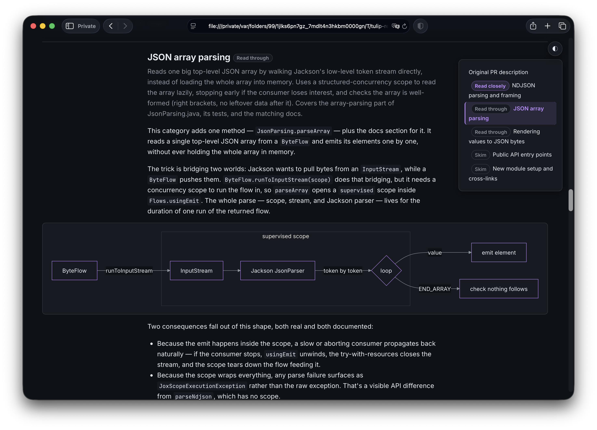
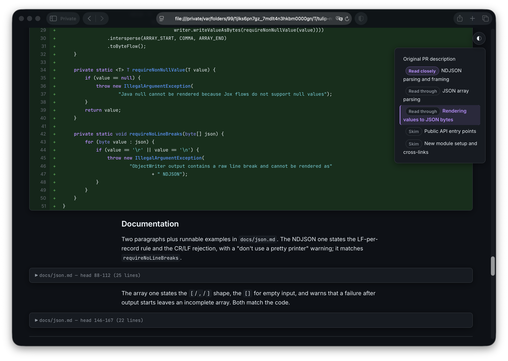

# Tulip

Tulip explains GitHub PRs - categorizing and prioritizing the changes - and
presenting them on a web page as prose, diagrams, and code.

Every code change appears *somewhere* in the explanation, so nothing slips past
you. Yet you don't have to wade through it all: instead of digging through piles
of code to find the logic that matters, you can focus on the algorithms, the
design choices, the core functionality. The explanations are top-down: a
high-level overview first, then down into the code.

And if you don't know the codebase at all, the prose and the generated diagrams
may be enough on their own to understand the PR well enough to accept or reject
it.

Tulip uses the headless `claude` CLI to do the analysis. No API key needed, just
a logged-in Claude Code.

<p align="center">
  <a href="screens/diagram.png"></a>
  <a href="screens/code.png"></a>
</p>

<sub>Click a screenshot to view it full size.</sub>

## How it works

Tulip fetches the PR and runs it through a few LLM passes, each using a model
sized to the job (Haiku, Sonnet, or Opus):

1. **Fetch & check out.** Get the PR (title, description, diff) via `gh` (or the
   GitHub API), check out its head revision, and write the full diff plus the
   before-versions of changed files into the checkout, so later passes can read
   the real code.
2. **Categorize** (Sonnet). Split the changes into a few self-contained groups by
   concern — tests and docs ride along with the code they belong to. Each group
   gets an *attention* rating (Read closely / Read through / Skim); groups are
   ordered most-important first. A second Sonnet pass reviews the groups and
   amends them if the split is off.
3. **Split large changes** (Sonnet). For each change over a size threshold, decide
   whether it spans more than one group's concern and, if so, where to cut it —
   turned into an exact partition in code, so no line is lost. This lets the next
   step route the pieces of a big multi-concern file to different groups.
4. **Classify** (Haiku). Assign every change to one or more groups and mark it as
   production or test code. Unfitting changes can propose a new group; generated
   files and lockfiles are dropped; every change is checked to be covered. A change
   that lands in several groups is *owned* by one — its highest-attention group —
   and only linked from the others.
5. **Explain** (Opus, one session per group; Sonnet review). Write a top-down prose
   explanation grounded in the real code: open with the overall shape and an
   orienting diagram, then drill into each change — leading with its interface,
   folding routine code by default, and showing in full only what the group's
   attention rating and the must-see cases demand. A change owned by another group
   is linked, not re-explained. A Sonnet pass reviews each explanation; every
   referenced snippet is checked to appear and every diagram validated to render.
6. **Render.** Assemble everything into one self-contained HTML page: light/dark
   theme, floating table of contents, syntax-highlighted side-by-side diffs, and
   the attention badges.

The result is a temporary directory with the page; Tulip logs the `file://` path
to open.

## Prerequisites

- [Node.js](https://nodejs.org/) LTS (>= 24) and [pnpm](https://pnpm.io/)
- A logged-in [`claude`](https://claude.com/product/claude-code) CLI on `PATH` —
  Tulip drives it to analyze the PR
- Optionally, the [`gh`](https://cli.github.com/) CLI, logged in — used to fetch
  PR data when available; Tulip falls back to the GitHub REST API otherwise
  (set `GITHUB_TOKEN` to raise the unauthenticated rate limit)

## Install

```sh
pnpm install
pnpm build
pnpm add -g .
```

## Usage

```sh
tulip <PR URL> [options]
```

Example:

```sh
tulip https://github.com/owner/repo/pull/123
```

Flags: `--diff-threshold <n>`, `--verbose`. Run `tulip --help` for details, or
`tulip --version` for the build.

On success, Tulip logs a `file://...` path to the generated HTML page — open it
in a browser.

## Development

```sh
pnpm build        # compile TypeScript + copy rendering assets
pnpm test         # run the test suite (vitest)
pnpm lint         # check formatting/lint rules (biome)
pnpm lint:fix     # auto-fix formatting/lint issues
pnpm dev <PR URL> # run the CLI from source, no build step (tsx)
```

Design decisions are recorded as ADRs in `docs/adr/`; the LLM prompts live as
plain text in `src/prompts/`.
